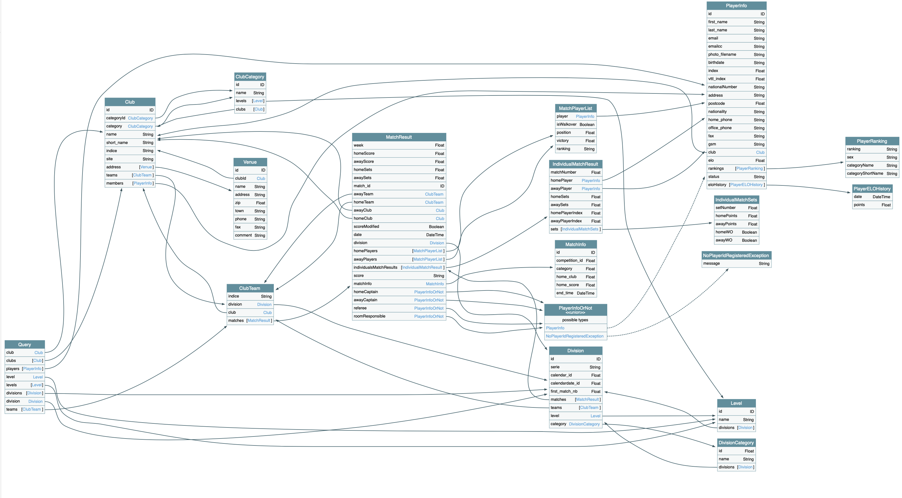

# TabT-GraphQL server

[![Build status][build-badge]][build-url]
[![License][license-badge]][license-url]

> GraphQL replacement of the TabT SOAP API.

This is a GraphQL server that allows you to fetch data from a TabT instance.



## Prerequisites

- A running TabT instance (http://tabt.frenoy.net/)
- Node 10 or higher (https://nodejs.org/)

## Installation

```sh
git clone https://github.com/Fllorent0D/Tabt-GraphQL
NODE_ENV='production' npm install
NODE_ENV='production' npm run build
NODE_ENV='production' nodejs ./dist/index.js
```

A environment file (```.env```) must be created:

```dotenv
DB_HOST=localhost
DB_PORT=3306
DB_USERNAME=root
DB_PASSWORD=myRootpwd32
DB_NAME=Tabt
JWT_SECRET_SALT=secret
JWT_EXPIRE_TIME=6h
```

### Start with pm2

```sh
pm2 start ./dist/index.js
```

## Development setup

```sh
git clone https://github.com/Fllorent0D/Tabt-GraphQL
npm install
npm run start
```

## Release History

* 0.0.1
    * Work in progress

## Meta

Cardoen Florent – [@Fllorent0D](https://twitter.com/fllorent0D) – f.cardoen@me.com

## Contributing

1. Fork it (<https://github.com/Fllorent0D/Tabt-GraphQL>)
2. Create your feature branch (`git checkout -b feature/fooBar`)
3. Commit your changes (`git commit -am 'Add some fooBar'`)
4. Push to the branch (`git push origin feature/fooBar`)
5. Create a new Pull Request

[build-badge]: https://github.com/Fllorent0D/Tabt-GraphQL/workflows/Build/badge.svg
[build-url]: https://github.com/Fllorent0D/Tabt-GraphQL/actions?query=workflow%3A%22Build+and+deploy+staging%22
[license-badge]: https://img.shields.io/badge/License-GPL--3-blue.svg?style=flat
[license-url]: LICENSE